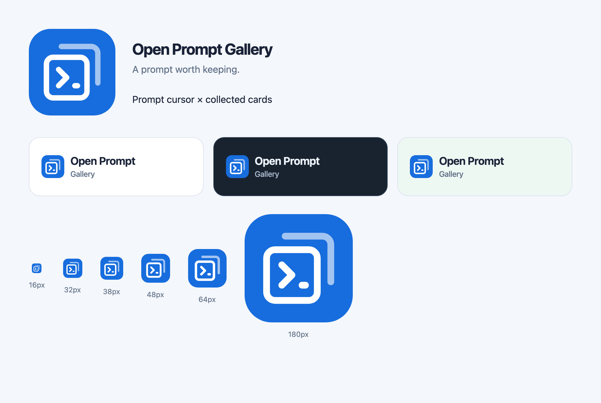

# Open Prompt Gallery identity

The mark combines a prompt cursor (`>_`) with two collected cards: writing and
reuse inside a personal gallery. Rounded corners match the interface, while a
flat Ocean blue (`#176DDD`) tile and white strokes keep it recognizable across
Ocean, Forest, and Violet palettes, in both light and dark mode. The existing
system-font wordmark remains beside it in navigation.

## Source and usage

Edit `public/brand/logo.svg`, then run `npm run brand:generate` and commit the
resulting assets. The generator uses the existing Sharp dependency and can run
from any working directory. Generated files are checked in; no extra production
build step is required.

- `BrandMark` renders the SVG in desktop/mobile navigation, login, and setup.
  Beside the wordmark it is decorative; on auth pages it has the product name
  as alternative text.
- `src/app/icon.svg`: scalable browser icon.
- `src/app/favicon.ico`: 16, 32, and 48 pixel browser/shortcut images.
- `src/app/apple-icon.png`: opaque 180 pixel Apple touch icon; the OS supplies
  the final corner mask.
- `public/icons/icon-{192,512}.png`: web manifest icons.
- `src/app/manifest.json`: name and icon metadata, with normal browser display.
  This does not add offline support.

Next.js discovers the root icon and manifest files and generates their metadata
links for all pages. Keep the symbol's proportions and clear space; do not add
shadows or stretch the tile. The on-site mark is 38 pixels on desktop and 32 on
mobile; browser exports also cover smaller sizes.
