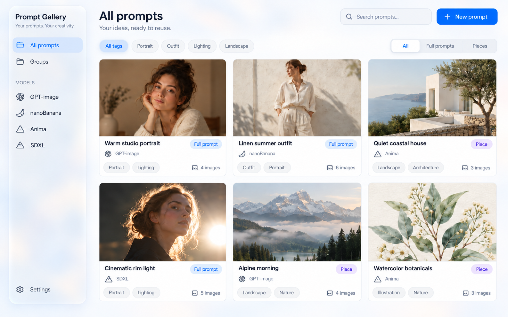
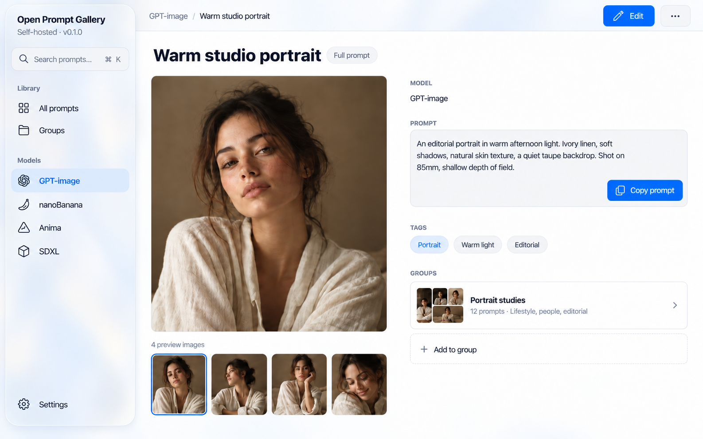

# Open Prompt Gallery — agreed design

Status: visual direction accepted on 2026-10-02 and implemented. The images below remain concept references; see [implementation status](../STATUS.md) for verification.

## Product

A self-hosted web application for managing image-generation prompts and reusable prompt pieces. Models are user-managed categories (examples: GPT-image, nanoBanana, Anima, SDXL), not integrations with generation APIs.

Required capabilities:

- Add, edit, and remove models through Settings.
- Create, read, edit, and delete prompts within a model category.
- Distinguish full prompts from reusable pieces, such as an outfit description.
- Add tags and quickly search/filter prompts using them.
- Create groups and associate prompts with groups.
- Attach multiple preview images to both prompts and groups.

## Accepted visual references

These are AI-generated concept images produced with the built-in image generation tool, not application screenshots. Preserve their visual direction rather than copying incidental inconsistencies in generated labels, icons, sample types, or spacing. Use the consistent product name “Open Prompt Gallery.” Sample photographs and prompt content are illustrative, not required seed data.

## Visual direction

Apple-inspired, calm, image-focused desktop workspace. Apply the `apple-design` skill at `/Users/caizhengxu/.agents/skills/apple-design/SKILL.md` during implementation.

The user accepted subtle Liquid Glass, but rejected exaggerated glossy buttons as unnatural. The final references supersede the earlier concepts with bright rims, raised jelly-like controls, and heavy glow.

- Concentrate glass on the floating sidebar and toolbar: frosted translucency, a fine light edge, subtle backdrop blur, and soft diffuse shadow.
- Use a predominantly pearl-white background with a faint cool ambient wash.
- Primary buttons use solid system blue and white text. No shiny gradients, bevels, neon outlines, glow halos, or inflated surfaces.
- Search fields use pale neutral surfaces and thin low-contrast borders.
- Selected navigation uses a flat pale-blue fill with blue text.
- Segmented controls use a quiet gray track and white selected segment with minimal shadow.
- Tags are subdued pills; selection must be intentional and consistent, not inferred from an incidental highlighted tag in the mockup.
- Content cards remain nearly white; images stay sharp and text has strong contrast.
- Use the system font, size-dependent tracking, clear weight hierarchy, and generous spacing.
- Use consistent simple line icons. Provider logos are not a requirement.

Starting implementation values, subject to browser review: primary blue `#007AFF`; control radius 8–10px; image/card radius 12–16px; sidebar radius 24px; spacing based on 4px increments. These are proposed values, not measured specifications from the images.

## Screens and navigation

### Library

- Floating left sidebar: All prompts, Groups, user-managed Models, Settings.
- Main heading with global search and New prompt action.
- Tag filters and All / Full prompts / Pieces segmented control.
- Responsive preview grid; three columns at the concept's desktop width.
- Each card shows cover image, title, model, type, tags, and image count.
- Provide a considered text-only card when a prompt has no images.

### Prompt detail

- Breadcrumb navigation and Edit/overflow actions.
- Title and Full prompt or Piece badge.
- Large preview with selectable thumbnail strip and image count.
- Model, complete selectable prompt text, Copy prompt action, tags, and linked groups.
- Clear way back to the filtered library; preserve search/filter state.

### Additional screens to implement in the same design system

- Prompt create/edit form: title, model, type, body, tags, groups, image uploads, cover selection, and image ordering/removal.
- Groups library and detail: title, description, own image gallery, associated prompts, add/remove membership.
- Group create/edit form including multiple images.
- Settings: model creation, editing, ordering if useful, and safe deletion behavior.
- Empty, loading, error, no-results, and upload-progress states.

## Interaction and accessibility

- Immediate press feedback; subtle motion only where it clarifies a state change.
- Interruptible, no-bounce springs around 0.3–0.4 seconds for appropriate panel transitions.
- Origin-aware popovers and symmetric entry/exit paths; never block input during animation.
- Keyboard navigation, visible focus, labeled icon buttons, semantic controls, accessible dialogs, and useful image alternative text.
- Respect reduced motion, reduced transparency, and increased contrast preferences. Offer solid material fallbacks when backdrop effects are unsupported.
- At narrow widths, collapse the sidebar into accessible navigation, reduce grid columns, stack detail columns, and keep actions reachable.
- Maintain clear text contrast over translucent surfaces and avoid expensive full-page blur effects.

## Image-generation provenance

Both final images were edits of the previous Liquid Glass concepts using the built-in image generation tool. The final editing brief preserved layout, photographs, labels, and typography; removed glossy bevels, glow, and raised control edges; specified flat `#007AFF` primary buttons and low-profile neutral controls; retained glass only on the sidebar/toolbar; thinned the sidebar rim; and reduced background saturation and shadow strength. The checked-in images are the durable visual reference for implementation.
